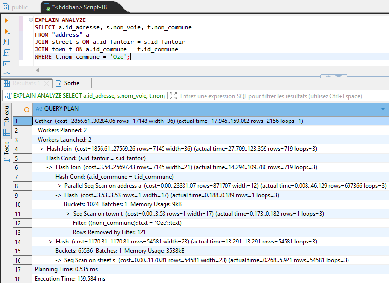
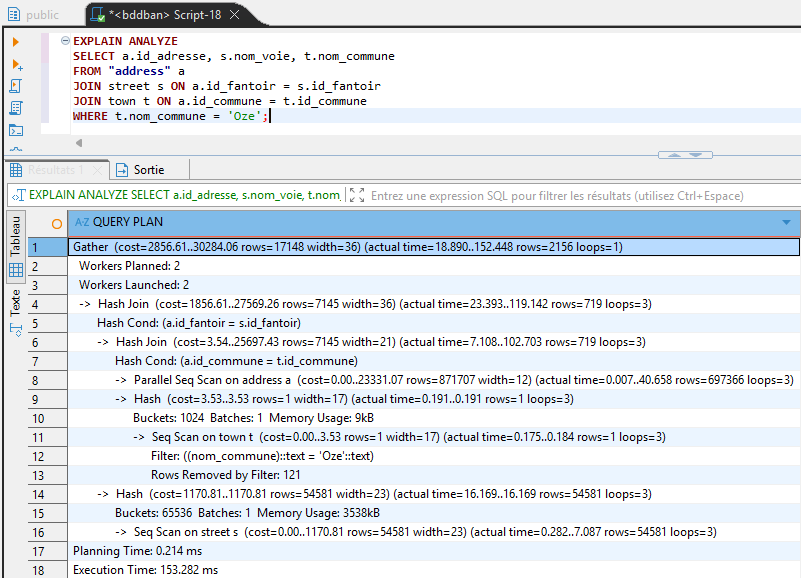

# Optimisation et analyse

L'ajout d'un index permet d'améliorer les performance et la vitesse de traitement des requête SQL.
Par exemple, ci-dessous les captures d'écran illustrant avant et après la création de l'index :

```sql
CREATE INDEX idx_town_nom_commune ON town(nom_commune);
```

---

## Avant la création de l'index :

- Planning Time: 0.535ms
- Execution Time: 159.584ms



## Après la création de l'index :

- Planning Time: 0.214ms
- Execution Time: 153.282ms


